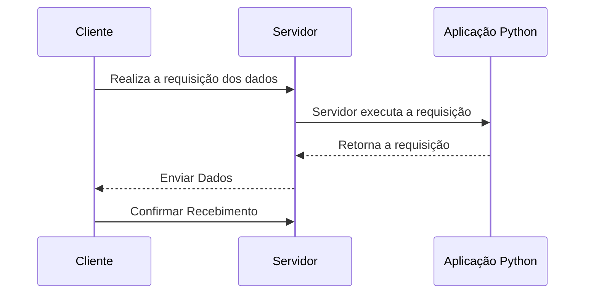
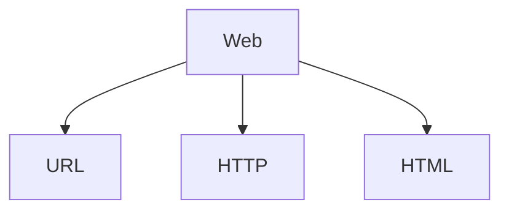
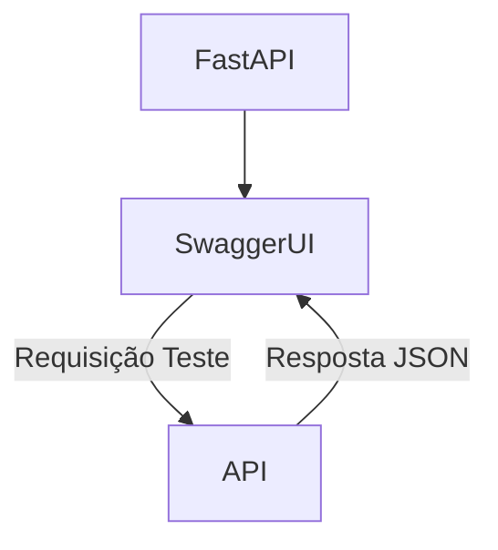
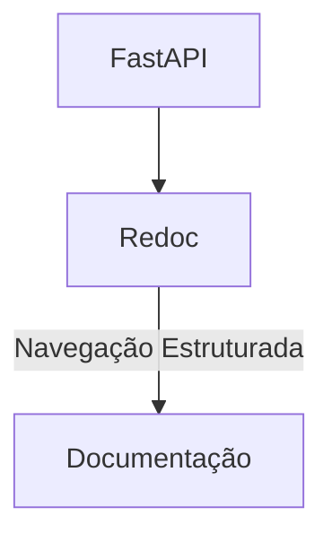

# 🚀 Gerenciador de Tarefas com FastAPI

Este projeto é uma aplicação web desenvolvida com **FastAPI**, um framework moderno e de alto desempenho para construção de APIs com Python. A aplicação simula um **gerenciador de tarefas (to-do list)**, implementando operações CRUD completas, autenticação com JWT, integração com banco de dados, testes automatizados e deployment com Docker.

A proposta é fornecer uma base sólida para o desenvolvimento de APIs robustas, escaláveis e modernas utilizando tecnologias atualizadas do ecossistema Python.

---

## 📚 Tecnologias e Ferramentas Utilizadas

- **FastAPI (v0.115+)**: Framework web moderno e eficiente.
- **Pydantic (v2+)**: Validação de dados e criação de schemas.
- **SQLAlchemy (v2+)**: ORM para modelagem e persistência de dados.
- **Alembic**: Gerenciamento de migrações de banco de dados.
- **Pytest**: Testes automatizados com cobertura de código.
- **Uvicorn**: Servidor ASGI para rodar a aplicação.
- **Docker**: Conteinerização para ambiente de produção.
- **Fly.io**: Deploy simples e gratuito para aplicações web.

---

## 🧱 Arquitetura Cliente-Servidor

Modelo em que o cliente realiza requisições ao servidor, que processa e retorna respostas.



---

## 🌐 Modelo Padrão da Web

Os três pilares principais utilizados nesta aplicação:



---

## 🔌 O que é uma API?

**API (Application Programming Interface)** é um conjunto de regras que permite a comunicação entre diferentes sistemas.

- Troca de dados geralmente em **JSON**.
- Integrações entre sistemas diversos.
- Expõe apenas os dados necessários, mantendo o restante encapsulado.

### Métodos HTTP utilizados:

- `GET`: Recuperar informações.
- `POST`: Criar novos dados.
- `PUT`: Atualizar dados existentes.
- `DELETE`: Remover dados.

---

## 🧮 Validação com Pydantic

**Pydantic** facilita a criação de modelos de dados com validação automática de tipos.

### Vantagens:

- ✅ Validação automática de dados.
- 🧩 Suporte a dados complexos (listas, dicionários, modelos aninhados).
- ⚙️ Leve, eficiente e de fácil uso.
- 🆓 Código aberto com ampla comunidade.

---

## 🧪 Testes Automatizados

Utilizamos **pytest** para garantir a confiabilidade da aplicação, com testes automatizados para rotas e regras de negócio.

- Cobertura de testes com `coverage`
- Integração com GitHub Actions para CI

---

## 🔐 Autenticação JWT

O sistema de autenticação utiliza **JSON Web Tokens (JWT)** para proteger rotas privadas da aplicação, permitindo que apenas usuários autenticados possam acessar certas funcionalidades.

---

## 🧪 Documentação Interativa com Swagger e Redoc

FastAPI fornece documentação interativa por padrão:

### Swagger UI

Interface para testar os endpoints via navegador.



### Redoc

Interface de leitura estruturada da documentação da API.



---

## 🐳 Docker e Deploy

A aplicação está preparada para execução via **Docker** e pode ser facilmente publicada em ambientes como **Fly.io**, otimizando o deploy para produção.

---

## 📁 Organização do Projeto

```
📦 app/
 ┣ 📂 api/              # Rotas e endpoints
 ┣ 📂 core/             # Configurações e inicializações
 ┣ 📂 models/           # Modelos de dados
 ┣ 📂 schemas/          # Schemas Pydantic
 ┣ 📂 services/         # Lógicas de negócio
 ┣ 📂 tests/            # Testes automatizados
 ┣ __init__.py
 ┗ main.py              # Ponto de entrada da aplicação
```

---

## ✅ Como Executar

```bash
# Instale as dependências
pip install -r requirements.txt

# Execute a aplicação localmente
uvicorn app.main:app --reload
```

Para testar, acesse:
- Swagger UI: http://localhost:8000/docs
- Redoc: http://localhost:8000/redoc

---

