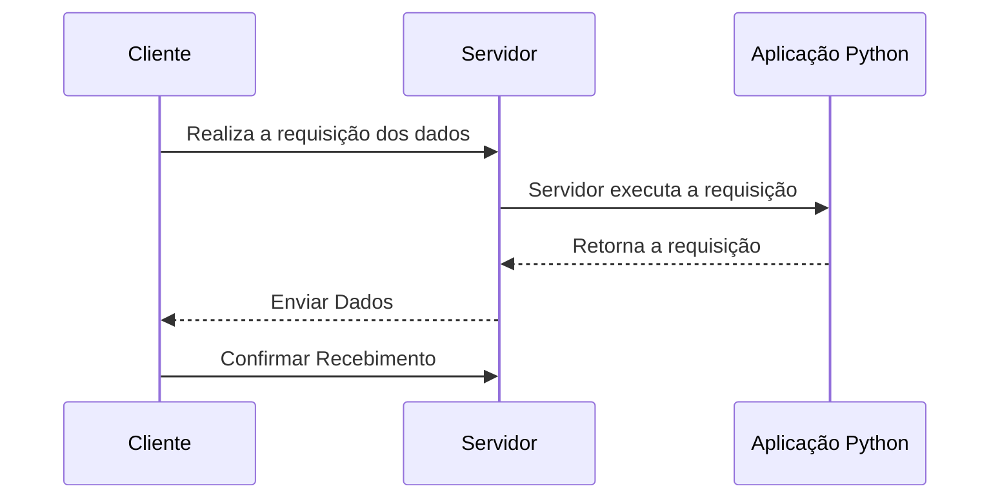
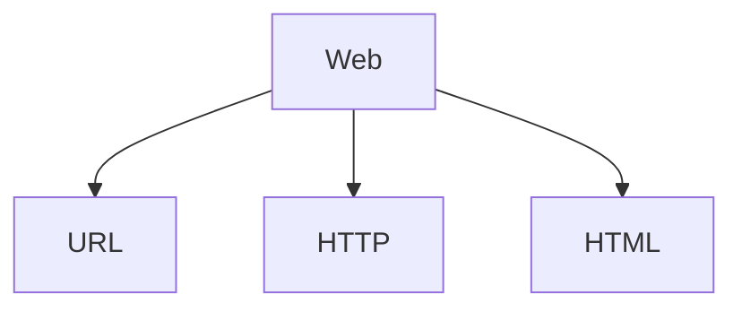

# Documentação - Curso FastAPI

## Definições:

### Arquitetura *Cliente-Servidor*

**Modelo que divide tarefas entre clientes e servidores**

- O cliente pode ser conectar ao servidor através de um aplicativo
- O servidor é centralizado e fica responsável por receber e respoder as solicitações dos clientes
- O cliente tem a possibilidade de executar outras tarefas enquanto o servidor retorna a solicitação

 

### O modelo padrão da web
 **Ignorando muita história e diversas camadas de padrões, podemos nos concentrar nos três padrões principais que serão mais importantes para nós agora:**

 

### Uvicorn

**O Uvicorn é um servidor *ASGI (Asynchronous Server Gateway Interface)* que permite executar aplicações web assíncronas escritas em python. Utilizado para lidar com solicitações HTTP e WebSocket**

- Utiliza um loop de eventos assíncronos para suportar conexões simultâneas de forma leve e rápida.

- Ideal para aplicações que exigem alto desempenho e capacidade de lidar com muitas conexões simultâneas.

---

### API's

 **API *(Application Programming Interfaces)* é um conjunto de regras e protocolos que permitem diferentes sistemas de computadores se comuniquem e compartilhem informações**

 - Frequentemente utilizam JSON *(JavaScript Object Notation)* para troca de dados. JSON é um formato leve de troca de dados, fácil de ler e escrever para humanos, e simples de interpretar e gerar para máquinas.

 - Permitem que os desenvolvedores integrem dados, serviços e recursos de outras aplicações.

 - Permitem o compartilhamento apenas das informações necessárias, mantendo ocultos outros detalhes internos do sistema.

 

**MÉTODOS HTTP:**

- **GET**: utilizado para recuperar recursos. Empregamos este verbo quando queremos solicitar um dado já existente no servidor.

- **POST**: permite criar um novo recurso. Por exemplo, enviar dados para registrar um novo usuário.

- **PUT**: Atualiza um recurso existente. Como, por exemplo, atualizar as informações de um usuário existente.

- **DELETE**: Exclui um recurso. Por exemplo, remover um usuário específico do sistema.

--- 

### Pydantic

No universo de APIs e contratos de dados, especialmente ao trabalhar com *Python*, o *Pydantic* se destaca como uma ferramenta poderosa e versátil. Essa biblioteca, altamente integrada ao ecossistema *Python*, especializa-se na criação de schemas de dados e na validação de tipos. Com o *Pydantic*, é possível expressar schemas *JSON* de maneira elegante e eficiente através de classes *Python*, proporcionando uma ponte robusta entre a flexibilidade do *JSON* e a segurança de tipos do *Python*.

**Características**

1. **Validação de dados**: O Pydantic inclui uma função de validação que verifica automaticamente os tipos e valores de atributos de classe, garantindo que eles estejam corretos e em conformidade com quaisquer restrições especificadas. Regras de validação personalizadas usando dicas de tipo Python também são suportadas, permitindo que os usuários definam restrições adicionais em seus dados.

2. **Suporte para tipos de dados complexos**: suporta uma ampla variedade de tipos de dados, incluindo listas, dicionários e modelos aninhados, facilitando a definição e a validação de estruturas de dados complexas.

3. **Eficiente e leve**: O Pydantic foi projetado para ser rápido e eficiente, com uma pequena base de código e dependências mínimas. Ele também é bem documentado e fácil de usar, o que o torna uma escolha popular para validação e análise de dados em Python.

4. **Código aberto**: Pydantic é uma biblioteca de código aberto, licenciada sob a licença MIT , e é ativamente desenvolvida e mantida por uma comunidade de colaboradores.

 

---