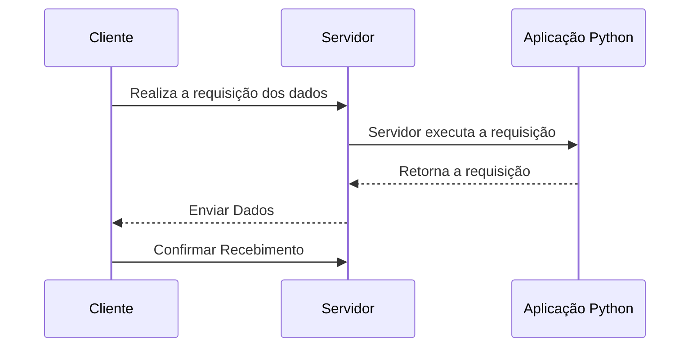
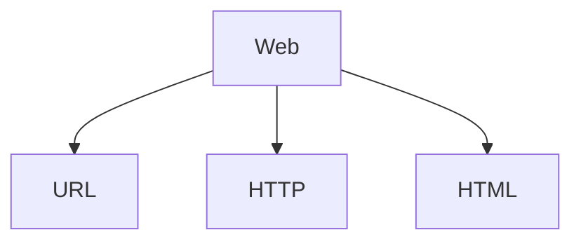
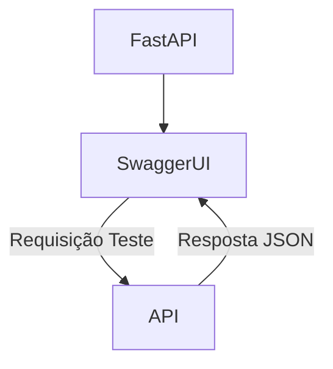
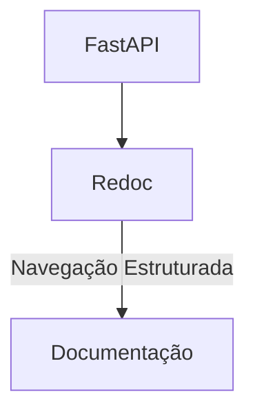

# 📘 Documentação - FastAPI

## Definições:

### 🧱 Arquitetura *Cliente-Servidor*

**Modelo que divide tarefas entre clientes e servidores**

- O cliente pode se conectar ao servidor através de um aplicativo
- O servidor é centralizado e fica responsável por receber e responder as solicitações dos clientes
- O cliente tem a possibilidade de executar outras tarefas enquanto o servidor retorna a solicitação

 

---

### 🌐 O modelo padrão da web

**Ignorando muita história e diversas camadas de padrões, podemos nos concentrar nos três padrões principais que serão mais importantes para nós agora:**

 

---

### 🚀 Uvicorn

**O Uvicorn é um servidor *ASGI (Asynchronous Server Gateway Interface)* que permite executar aplicações web assíncronas escritas em Python. Utilizado para lidar com solicitações HTTP e WebSocket**

- Utiliza um loop de eventos assíncronos para suportar conexões simultâneas de forma leve e rápida ⚡
- Ideal para aplicações que exigem alto desempenho e capacidade de lidar com muitas conexões simultâneas 📈

---

### 🔌 API's

**API *(Application Programming Interface)* é um conjunto de regras e protocolos que permitem diferentes sistemas de computadores se comunicarem e compartilharem informações**

- Frequentemente utilizam JSON *(JavaScript Object Notation)* para troca de dados 📄
- Permitem que os desenvolvedores integrem dados, serviços e recursos de outras aplicações 🤝
- Permitem o compartilhamento apenas das informações necessárias, mantendo ocultos outros detalhes internos do sistema 🔒

 

#### 🧭 MÉTODOS HTTP:

- **GET**: 🔍 Recuperar recursos existentes do servidor.
- **POST**: ➕ Criar um novo recurso (ex: cadastrar usuário).
- **PUT**: ♻ Atualizar um recurso existente.
- **DELETE**: ❌ Remover um recurso.

---

### 🧮 Pydantic

No universo de APIs e contratos de dados, especialmente ao trabalhar com *Python*, o *Pydantic* se destaca como uma ferramenta poderosa e versátil. Essa biblioteca, altamente integrada ao ecossistema *Python*, especializa-se na criação de *schemas* de dados e na validação de tipos.

Com o *Pydantic*, é possível expressar *schemas JSON* de maneira elegante e eficiente através de classes *Python*, proporcionando uma ponte robusta entre a flexibilidade do *JSON* e a segurança de tipos do *Python* 🛡️.

**🔍 Características:**

1. ✅ **Validação de dados**: Garante que os dados estejam corretos e em conformidade com as restrições especificadas.
2. 🧩 **Suporte para dados complexos**: Listas, dicionários e modelos aninhados são bem suportados.
3. ⚙️ **Eficiente e leve**: Pequena base de código, desempenho alto, fácil de usar.
4. 🆓 **Código aberto**: Licença MIT e com ampla comunidade ativa.

---

### 📄 Swagger UI e Redoc

Ao trabalhar com APIs em FastAPI, uma das grandes vantagens é a **documentação interativa automática**, gerada com base nas definições da própria aplicação. Isso é possível graças às interfaces **Swagger UI** e **Redoc**, integradas por padrão ao FastAPI 🚀.

Essas interfaces facilitam o consumo da API por desenvolvedores e times técnicos, fornecendo visualizações claras dos endpoints disponíveis, métodos, parâmetros esperados e respostas possíveis.

 

---

### 🧪 Swagger UI

**Swagger UI** é uma interface visual que permite testar os endpoints da API diretamente pelo navegador 🌐.

- Documentação interativa e prática
- Testes diretos via navegador
- Suporte total a métodos e schemas definidos
- Baseada nas anotações com Pydantic e FastAPI

 

#### 📘 Redoc

**Redoc** é uma alternativa à Swagger UI com foco em clareza, estrutura e visual limpo 🧼.

- Ideal para apresentações e documentação pública
- Estrutura hierárquica por rota
- Layout profissional e fácil de navegar
- Também gerado automaticamente

 

💡 Essas ferramentas fazem parte do ecossistema **OpenAPI**, um padrão amplamente adotado para definição de APIs RESTful. O FastAPI gera a documentação automaticamente com base nos modelos e definições feitas com *Pydantic* e nos decoradores das rotas da API.
